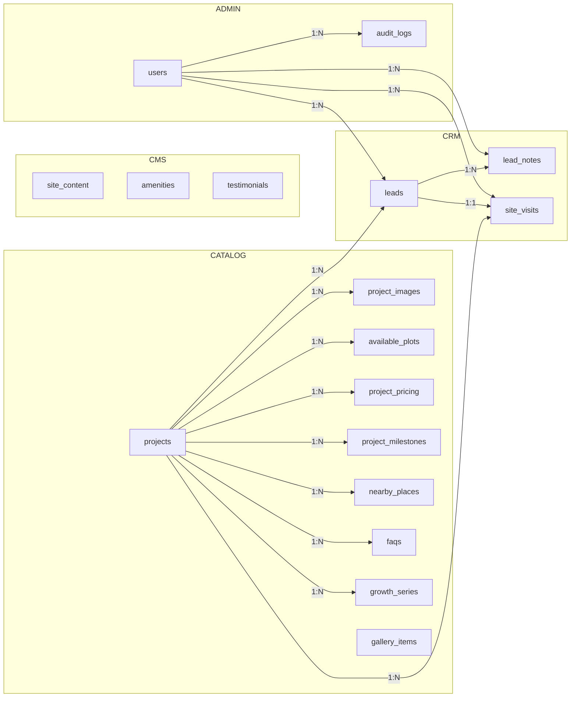

# Phase 7.1 — Backend Blueprint (Xano)

> **Status:** APPROVED.
> **Approval date:** 2026-08-03
> **Gate rule (historic):** No Xano tables, functions, or endpoints were created until this document was approved. Approval lifted the gate — implementation proceeds per §7 Recommended Implementation Order.
> **Serves:** The frozen frontend (Phases 1–6). Every table below maps to an existing typed contract in `src/types/*` and a call site in `src/services/*`. The services layer is the only network boundary and the DTO mapper; the schema is designed so mappers stay trivial.

---

## 1. Scope & Conventions

### 1.1 Goal
A normalized, production-ready relational schema on Xano for: the public marketing site (content/catalog), the lead pipeline (CRM), and the future admin dashboard (Phase 6 scope). Not over-normalized — optimized for the exact read shapes the frontend already consumes.

### 1.2 Naming & data type conventions

| Convention | Rule |
|---|---|
| Table names | Plural `snake_case` |
| Column names | `snake_case` |
| Primary keys | UUID `id` on every table (Xano `uuid` type) — collision-safe for client-generated refs, sync, and multi-env |
| Foreign keys | `{table}_id` + `uuid`, nullable where the relationship is optional |
| Timestamps | `created_at`, `updated_at` on every row (Xano adds automatically) |
| Money | `price_inr` stored as **integer whole rupees** (never float). Frontend already formats INR |
| Booleans | `boolean` |
| Enum-ish statuses | Xano `enum` type where the value set is small and fixed |
| Soft delete | `is_active boolean default true` + `deleted_at timestamp null` on admin-editable content |
| Slug | Unique, lowercase, `kebab-case`, immutable once published |

### 1.3 Cross-cutting rules (apply to every table)

- All text content is **client-escaped on output** by React; server must still reject control chars in display strings.
- `created_at` / `updated_at` are maintained by Xano; do not trust client timestamps.
- No PII may appear in `audit_logs` (log ids, never raw names/phones/emails).
- Soft-deleted rows are excluded by default via an `is_active = true` filter in every query function.
- Money fields validated ≥ 0; `starting_price_inr` may be `null` (= "Contact us", per `Project.startingPriceInr?`).

---

## 2. Table Catalog Overview

| # | Table | Group | Serves frontend contract |
|---|---|---|---|
| T1 | `projects` | Catalog | `Project` |
| T2 | `project_images` | Catalog | `Project.images / .gallery / .masterPlan` |
| T3 | `available_plots` | Catalog | `AvailablePlot[]` |
| T4 | `project_pricing` | Catalog | `PricingRow[]` |
| T5 | `project_milestones` | Catalog | `Milestone[]` |
| T6 | `nearby_places` | Catalog | `NearbyPlace[]` |
| T7 | `faqs` | CMS (shared) | `FaqItem[]` (site `/faq` + `Project.faq`) |
| T8 | `growth_series` | CMS (shared) | `GrowthDatum[]` (site default + per-project override) |
| T9 | `gallery_items` | CMS | `GalleryItem[]` |
| T10 | `site_content` | CMS | `SiteContent` copy blocks (hero, about, stats, …) |
| T11 | `amenities` | CMS | `Amenity[]` (site-level) |
| T12 | `testimonials` | CMS | `Testimonial[]` |
| T13 | `leads` | CRM | `Lead` + admin workflow |
| T14 | `lead_notes` | CRM (admin) | — |
| T15 | `site_visits` | CRM (admin) | — (Phase 6) |
| T16 | `users` | Auth (Xano) | admin auth |
| T17 | `audit_logs` | Admin | — |

---

## 3. Table Definitions

### T1 — `projects`

**Purpose:** Single source of truth for every phase/block offered at Signature City. Maps 1:1 to `Project`.

| Field | Type | Req | Default | Key | Notes |
|---|---|---|---|---|---|
| `id` | uuid | ✅ | — | **PK** | |
| `slug` | text | ✅ | — | **UX1** | Unique, kebab-case, immutable after publish |
| `title` | text | ✅ | — | | e.g. "The Estate Block" |
| `status` | enum(`available`,`premium`,`launching`,`sold-out`) | ✅ | `available` | **IX1** | Matches `ProjectStatus` |
| `district` | text | ✅ | — | **IX2** | Filterable zone, e.g. "Growth Corridor" (denormalized for list filters; see `districts` note §6) |
| `location` | text | ✅ | — | | e.g. "Premium Block B" |
| `plot_sizes` | json | ✅ | `[]` | | `string[]`, e.g. `["20×30","20×40"]` |
| `starting_price_inr` | integer | ❌ | `null` | **IX3** | `null` = "Contact us"; ≥ 0 |
| `acreage` | text | ✅ | — | | e.g. "1.9 Acres" (display string) |
| `tagline` | text | ✅ | — | | |
| `description` | long text | ✅ | — | | SEO/meta blurb |
| `short_description` | long text | ✅ | — | | Card copy on listing |
| `overview` | json | ✅ | `[]` | | `string[]` paragraphs |
| `features` | json | ✅ | `[]` | | `string[]` highlight bullets |
| `investment_benefits` | json | ✅ | `[]` | | `string[]` |
| `is_featured` | boolean | ✅ | `false` | **IX4** | Home/featured ordering |
| `display_order` | integer | ✅ | `0` | **IX5** | Manual ordering on listing |
| `map_url` | text | ❌ | `null` | | Overrides global map link (else falls back to `SITE.mapUrl`) |
| `is_active` | boolean | ✅ | `true` | **IX6** | Soft delete |
| `deleted_at` | timestamp | ❌ | `null` | | |
| `created_at` | timestamp | ✅ | auto | | |
| `updated_at` | timestamp | ✅ | auto | | |

**Validation rules**
- `slug` matches `^[a-z0-9]+(?:-[a-z0-9]+)*$`, unique (case-insensitive), max 100 chars.
- `status` must be one of the 4 enum values; invalid → 400.
- `starting_price_inr ≥ 0`; empty string → `null`.
- `title` non-empty, ≤ 120 chars; `description` ≤ 300 chars (meta limit).
- `plot_sizes` array items ≤ 12 chars; deduplicated.
- `overview`/`features`/`investment_benefits` max 12 items each.

**Indexes**
- `IX1 status` — status filter.
- `IX2 district` — district filter.
- `IX3 starting_price_inr` — budget filter + price sort.
- `IX4 is_featured` — featured sort.
- `IX5 (display_order, status)` — default listing sort.
- `UX1 slug` — unique lookup.
- `IX6 is_active` — soft-delete exclusion.

**Relationships**
- 1 → N `project_images` (`project_id`)
- 1 → N `available_plots` (`project_id`)
- 1 → N `project_pricing` (`project_id`)
- 1 → N `project_milestones` (`project_id`)
- 1 → N `nearby_places` (`project_id`)
- 1 → N `faqs` (`project_id`, nullable — project FAQs)
- 1 → N `growth_series` (`project_id`, nullable — override)
- 1 → N `leads` (`project_id`, nullable)
- 1 → N `site_visits` (via `leads`)

**Future scalability**
- When volume grows, move `overview`, `features`, `investment_benefits` to child tables for per-item editing; keep JSON while they are edited as atomic copy blocks.
- `districts` as a lookup table when > ~8 districts (tidy admin filter, consistent names).
- Add `locale` field when i18n ships (D14 in foundation doc).

---

### T2 — `project_images`

**Purpose:** All imagery attached to a project — hero, gallery thumbnails, and the master-plan diagram. Maps to `Project.images`, `Project.gallery`, `Project.masterPlan` (`ImageAsset[]`).

| Field | Type | Req | Default | Key | Notes |
|---|---|---|---|---|---|
| `id` | uuid | ✅ | — | **PK** | |
| `project_id` | uuid | ✅ | — | **FK→projects / IX1** | Cascade delete |
| `role` | enum(`hero`,`gallery`,`master_plan`) | ✅ | `gallery` | **IX2** | Which collection the image belongs to |
| `sort_order` | integer | ✅ | `0` | **IX3** | Order within role |
| `src` | text | ❌ | `null` | | Cloudinary URL; `null` renders branded placeholder (`ImageAsset.src?`) |
| `alt` | text | ✅ | — | | Meaningful alt; decorative → `""` |
| `caption` | text | ❌ | `null` | | Optional caption |
| `is_active` | boolean | ✅ | `true` | **IX4** | |
| `created_at` | timestamp | ✅ | auto | | |
| `updated_at` | timestamp | ✅ | auto | | |

**Validation rules**
- `project_id` must reference an existing, active project.
- `alt` required unless deliberately empty string (decorative).
- `src`, when present, must be a valid HTTPS URL (Cloudinary origin allowlist).
- At most 1 `hero` and 1 `master_plan` per project (enforce in create/update function).

**Indexes**
- `IX1 (project_id)` — load images per project.
- `IX2 (project_id, role)` — collection lookup.
- `IX3 (project_id, role, sort_order)` — ordering.
- `IX4 is_active`.

**Relationships**
- N → 1 `projects`.

**Future scalability**
- Promote to a shared `media_library` (T2b) once a global asset manager is needed: `media_assets(id, cloudinary_public_id, url, alt, caption, width, height, tags)`, and `project_images` becomes a thin mapping row. Cloudinary is the storage authority (D6 in foundation doc).

---

### T3 — `available_plots`

**Purpose:** Individually sellable plots within a project. Maps to `AvailablePlot[]`.

| Field | Type | Req | Default | Key | Notes |
|---|---|---|---|---|---|
| `id` | uuid | ✅ | — | **PK** | |
| `project_id` | uuid | ✅ | — | **FK→projects / IX1** | Cascade delete |
| `size` | text | ✅ | — | | e.g. "20×30" |
| `dimensions` | text | ✅ | — | | e.g. "6000 sq. ft." |
| `facing` | text | ✅ | — | | e.g. "East", "Garden-facing", "Corner" |
| `price_inr` | integer | ✅ | — | **IX2** | ≥ 0 |
| `status` | enum(`available`,`reserved`,`sold`) | ✅ | `available` | **IX3** | Matches `PlotAvailability` |
| `display_order` | integer | ✅ | `0` | **IX4** | |
| `is_active` | boolean | ✅ | `true` | | |
| `created_at` | timestamp | ✅ | auto | | |
| `updated_at` | timestamp | ✅ | auto | | |

**Validation rules**
- `price_inr ≥ 0`; `size` pattern `^\d+[×x]\d+$` (accept both `×` and `x`), ≤ 12 chars.
- `status` enum; transitions logged via `audit_logs` when changed by admin.

**Indexes**
- `IX1 (project_id)` — detail page load.
- `IX2 (project_id, status)` — count available for "Secure Your Address" subtitle.
- `IX3 (project_id, display_order)`.

**Relationships**
- N → 1 `projects`.

**Future scalability**
- Add geo columns (`plot_number`, `lat`, `lng`) for an interactive plot map.
- When a plot is reserved/sold, link `leads` or `sales` row for traceability; the `project_slug` on `leads` today resolves via project anyway.

---

### T4 — `project_pricing`

**Purpose:** Simple per-size price points shown in the "Transparent Price Points" section. Maps to `PricingRow[]`.

| Field | Type | Req | Default | Key | Notes |
|---|---|---|---|---|---|
| `id` | uuid | ✅ | — | **PK** | |
| `project_id` | uuid | ✅ | — | **FK→projects / IX1** | Cascade delete |
| `size` | text | ✅ | — | | e.g. "20×30" |
| `dimensions` | text | ✅ | — | | e.g. "6000 sq. ft." |
| `start_price_inr` | integer | ✅ | — | | ≥ 0 |
| `note` | text | ❌ | `null` | | e.g. "Corner +" |
| `display_order` | integer | ✅ | `0` | **IX2** | |
| `is_active` | boolean | ✅ | `true` | | |
| `created_at` / `updated_at` | timestamp | ✅ | auto | | |

**Validation rules**
- `start_price_inr ≥ 0`; `size` same pattern as T3.
- Duplicate `(project_id, size)` rejected.

**Indexes**
- `IX1 (project_id)`, `IX2 (project_id, display_order)`.

**Relationships**
- N → 1 `projects`.

**Future scalability**
- Add `effective_from`, `effective_to` for dated price lists; treat "current price" as the row where `effective_to IS NULL`.

---

### T5 — `project_milestones`

**Purpose:** Build/approval timeline shown in "Project timeline". Maps to `Milestone[]`.

| Field | Type | Req | Default | Key | Notes |
|---|---|---|---|---|---|
| `id` | uuid | ✅ | — | **PK** | |
| `project_id` | uuid | ✅ | — | **FK→projects / IX1** | Cascade delete |
| `phase` | enum(`Completed`,`In progress`,`Upcoming`,`Ongoing`) | ✅ | `Upcoming` | | |
| `title` | text | ✅ | — | | |
| `description` | long text | ✅ | — | | |
| `display_order` | integer | ✅ | `0` | **IX2** | Chronological |
| `is_active` | boolean | ✅ | `true` | | |
| `created_at` / `updated_at` | timestamp | ✅ | auto | | |

**Validation rules**
- `title` ≤ 120 chars; `description` ≤ 500 chars.
- `phase` enum.

**Indexes**
- `IX1 (project_id)`, `IX2 (project_id, display_order)`.

**Relationships**
- N → 1 `projects`.

**Future scalability**
- Add `date` for dated timelines; `status` can drive a visual rail later.

---

### T6 — `nearby_places`

**Purpose:** Points of interest around a project ("Nearby places"). Maps to `NearbyPlace[]`.

| Field | Type | Req | Default | Key | Notes |
|---|---|---|---|---|---|
| `id` | uuid | ✅ | — | **PK** | |
| `project_id` | uuid | ✅ | — | **FK→projects / IX1** | Cascade delete |
| `name` | text | ✅ | — | | |
| `category` | enum(`School`,`Hospital`,`Shopping`,`Connectivity`,`Transit`,`Recreation`) | ✅ | — | **IX2** | Matches `NEARBY_ICONS` map |
| `distance` | text | ✅ | — | | Display string, e.g. "2.4 km" |
| `display_order` | integer | ✅ | `0` | | |
| `is_active` | boolean | ✅ | `true` | | |
| `created_at` / `updated_at` | timestamp | ✅ | auto | | |

**Validation rules**
- `category` enum; `name` ≤ 80 chars; `distance` matches `^\d+(\.\d+)?\s?(km|mi)$`.

**Indexes**
- `IX1 (project_id)`, `IX2 (project_id, category)`.

**Relationships**
- N → 1 `projects`.

**Future scalability**
- Add `lat`/`lng` for a future interactive map; store `distance_km` numeric for sorting.

---

### T7 — `faqs`

**Purpose:** Single FAQ store shared by the site-wide `/faq` page and project detail sections. Maps to `FaqItem[]`. Rows with `project_id = null` are site-wide; rows with a project belong to that project.

| Field | Type | Req | Default | Key | Notes |
|---|---|---|---|---|---|
| `id` | uuid | ✅ | — | **PK** | |
| `project_id` | uuid | ❌ | `null` | **FK→projects / IX1** | `null` = site-wide FAQ |
| `question` | text | ✅ | — | | |
| `answer` | long text | ✅ | — | | |
| `display_order` | integer | ✅ | `0` | **IX2** | |
| `is_active` | boolean | ✅ | `true` | | |
| `created_at` / `updated_at` | timestamp | ✅ | auto | | |

**Validation rules**
- `question` ≤ 200 chars, non-empty; `answer` non-empty.
- No duplicate `(project_id, question)`.

**Indexes**
- `IX1 (project_id)` (includes `null` for site-wide lookup).
- `IX2 (project_id, display_order)`.

**Relationships**
- N → 1 `projects` (optional).

**Future scalability**
- Add `category` for grouped FAQ; `updated_at` used to invalidate `GET /faq` cache.

---

### T8 — `growth_series`

**Purpose:** Annual land-value growth index. `project_id = null` rows form the site-wide default series (fallback used by `project.investmentGrowth ?? investmentGrowth`); non-null rows override a project's series. Maps to `GrowthDatum[]`.

| Field | Type | Req | Default | Key | Notes |
|---|---|---|---|---|---|
| `id` | uuid | ✅ | — | **PK** | |
| `project_id` | uuid | ❌ | `null` | **FK→projects / IX1** | `null` = site-wide series |
| `year` | text | ✅ | — | **IX2** | e.g. "2018" (kept text per contract) |
| `value` | number | ✅ | — | | Relative index; `100` = baseline |
| `display_order` | integer | ✅ | `0` | | Chronological |
| `is_active` | boolean | ✅ | `true` | | |
| `created_at` / `updated_at` | timestamp | ✅ | auto | | |

**Validation rules**
- `value ≥ 0`; unique `(project_id, year)`.
- Exactly one active series per project (or the single site-wide series).

**Indexes**
- `IX1 (project_id)`; `IX2 (project_id, year)`.

**Relationships**
- N → 1 `projects` (optional).

**Future scalability**
- Add `source`/`effective_date` when real (non-indicative) index data arrives; chart is currently labeled "Indicative".

---

### T9 — `gallery_items`

**Purpose:** Public photo gallery on `/gallery`. Maps to `GalleryItem[]` (`image: ImageAsset`).

| Field | Type | Req | Default | Key | Notes |
|---|---|---|---|---|---|
| `id` | uuid | ✅ | — | **PK** | |
| `category` | enum(`Master Plan`,`Lifestyle`,`Progress`,`Approvals`) | ✅ | `Lifestyle` | **IX1** | Matches `GalleryCategory` |
| `src` | text | ❌ | `null` | | Cloudinary URL; `null` = placeholder |
| `alt` | text | ✅ | — | | |
| `caption` | text | ❌ | `null` | | |
| `display_order` | integer | ✅ | `0` | **IX2** | |
| `is_active` | boolean | ✅ | `true` | | |
| `created_at` / `updated_at` | timestamp | ✅ | auto | | |

**Validation rules**
- `alt` required unless decorative; `src` HTTPS when present; `category` enum.

**Indexes**
- `IX1 (category, is_active)`, `IX2 (display_order)`.

**Relationships**
- None (standalone). Optionally relate to `media_assets` later.

**Future scalability**
- Add `featured` flag; migrate to `media_library` when the admin gallery manager ships.

---

### T10 — `site_content`

**Purpose:** Atomic marketing copy blocks the admin edits via CMS (hero, trust bar, stats, location, premium plots, investment, why-choose, about, journey, amenity pillars). One row per content key. Maps to `fetchSiteContent()` / `SiteContent` (the mapper assembles keys into the frontend shape).

| Field | Type | Req | Default | Key | Notes |
|---|---|---|---|---|---|
| `id` | uuid | ✅ | — | **PK** | |
| `key` | text | ✅ | — | **UX1** | `hero`, `trust_bar`, `stats`, `location`, `premium_plots`, `investment`, `why_choose`, `about`, `journey`, `amenity_pillars`, `hero_card`, `investment_growth_ref` |
| `content` | json | ✅ | — | | Typed JSON block matching the frontend section shape |
| `version` | integer | ✅ | `1` | | Optimistic concurrency on admin edits |
| `is_active` | boolean | ✅ | `true` | | |
| `created_at` / `updated_at` | timestamp | ✅ | auto | | |

**Validation rules**
- `key` must be in the allowed set (else mapper can't build `SiteContent`).
- `content` must deserialize to the section's TS type; shape-validated server-side with a per-key validator.
- Admin update uses `version` (If-Match) to prevent lost updates.

**Indexes**
- `UX1 key` (unique).

**Relationships**
- None (self-contained per key). `stats`, `amenities`, `testimonials`, `growth`, `faqs` are normalized into T11/T12/T8/T7 because they are list-edited; single-object sections live here as JSON.

**Future scalability**
- Split `content` into typed child tables when sections need granular editing; the admin UI decides later — the frontend contract does not change (mapper absorbs it).

---

### T11 — `amenities`

**Purpose:** Site-level amenity cards ("Amenities That Make It Home"). Maps to `Amenity[]`.

| Field | Type | Req | Default | Key | Notes |
|---|---|---|---|---|---|
| `id` | uuid | ✅ | — | **PK** | |
| `title` | text | ✅ | — | | e.g. "24×7 Security" |
| `description` | text | ✅ | — | | |
| `icon` | text | ✅ | — | **IX1** | Lucide icon key, e.g. `shield`, `trees` |
| `display_order` | integer | ✅ | `0` | | |
| `is_active` | boolean | ✅ | `true` | | |
| `created_at` / `updated_at` | timestamp | ✅ | auto | | |

**Validation rules**
- `icon` must be a known icon key (else frontend falls back — validate against allowlist).
- `title` ≤ 80 chars; `description` ≤ 200 chars.

**Indexes**
- `IX1 (is_active, display_order)`.

**Relationships**
- None.

**Future scalability**
- Add `category` to group into the "pillars" layout later.

---

### T12 — `testimonials`

**Purpose:** Social proof on Home. Maps to `Testimonial[]`.

| Field | Type | Req | Default | Key | Notes |
|---|---|---|---|---|---|
| `id` | uuid | ✅ | — | **PK** | |
| `quote` | long text | ✅ | — | | |
| `name` | text | ✅ | — | | e.g. "R. Mehta" |
| `role` | text | ✅ | — | | e.g. "NRI Investor" |
| `display_order` | integer | ✅ | `0` | | |
| `is_active` | boolean | ✅ | `true` | **IX1** | |
| `created_at` / `updated_at` | timestamp | ✅ | auto | | |

**Validation rules**
- `quote` ≤ 1000 chars; `name` ≤ 80; `role` ≤ 60.

**Indexes**
- `IX1 (is_active, display_order)`.

**Relationships**
- None.

**Future scalability**
- Add `rating` (1–5) and `project_id` (testimonial attribution) when a reviews program starts.

---

### T13 — `leads`

**Purpose:** The enquiry pipeline — site visits, brochure requests, investment queries. Maps to `Lead` + admin workflow (list/filter/export/status). `project_slug` on the client is resolved to `project_id` at write time (keeps client contract unchanged).

| Field | Type | Req | Default | Key | Notes |
|---|---|---|---|---|---|
| `id` | uuid | ✅ | — | **PK** | |
| `project_id` | uuid | ❌ | `null` | **FK→projects / IX1** | Resolved from `projectSlug` |
| `name` | text | ✅ | — | | ≤ 120 chars |
| `phone` | text | ✅ | — | **IX2** | Normalized E.164; see validation |
| `email` | text | ❌ | `null` | **IX3** | Optional, validated |
| `interest` | enum(`site-visit`,`brochure`,`invest`,`general`) | ✅ | `general` | **IX4** | Matches `LeadInterest` |
| `message` | long text | ❌ | `null` | | ≤ 2000 chars |
| `consent` | boolean | ✅ | `false` | | Must be `true` to persist (legal) |
| `source` | text | ❌ | `'direct'` | | `utm_*` / page, set server-side from headers + query |
| `utm_campaign` | text | ❌ | `null` | | |
| `utm_source` | text | ❌ | `null` | | |
| `status` | enum(`new`,`contacted`,`qualified`,`booked`,`won`,`lost`) | ✅ | `new` | **IX5** | Admin workflow |
| `assigned_to` | uuid | ❌ | `null` | **FK→users / IX6** | Sales owner (admin) |
| `honeypot_flag` | boolean | ✅ | `false` | | Set true when the honeypot fired — row dropped, not stored |
| `ip_hash` | text | ❌ | `null` | | SHA-256 of IP for rate-limit forensics (no raw IP) |
| `is_active` | boolean | ✅ | `true` | | Admin soft-delete |
| `deleted_at` | timestamp | ❌ | `null` | | |
| `created_at` | timestamp | ✅ | auto | **IX7** | |
| `updated_at` | timestamp | ✅ | auto | | |

**Validation rules**
- `phone`: strip spaces/dashes; accept `+91` or leading `0`; store E.164 (`+919876543210`). Reject invalid digits. 10-digit Indian mobile enforced per the current form.
- `email`: standard format when present; lowercase.
- `consent` must be `true`, else 400 (GDPR/legal baseline from §17.3).
- Honeypot: if `company` field (client `Lead.company`) is non-empty, drop the lead and return 200 (never acknowledge spam detection).
- Rate limit: max 5 submissions / 10 min per `ip_hash` (Xano function).
- `interest` enum; `message` optional.
- Server-side `source` from headers — never trust client `source`.

**Indexes**
- `IX1 project_id`, `IX2 phone`, `IX3 email`, `IX4 interest`, `IX5 status`, `IX6 assigned_to`, `IX7 created_at` (desc — admin inbox ordering).

**Relationships**
- N → 1 `projects`, N → 1 `users` (assigned).
- 1 → N `lead_notes`; 1 → N `site_visits`.

**Future scalability**
- Split `phone` + `country_code`; add `priority`, `channel`, `last_activity_at` for CRM scoring.
- Archive leads > 24 months to a cold `leads_archive` table to keep inbox queries fast.

---

### T14 — `lead_notes`

**Purpose:** Internal notes/activity on a lead (admin only — never exposed publicly). Supports Phase 6 admin module.

| Field | Type | Req | Default | Key | Notes |
|---|---|---|---|---|---|
| `id` | uuid | ✅ | — | **PK** | |
| `lead_id` | uuid | ✅ | — | **FK→leads / IX1** | Cascade delete |
| `author_id` | uuid | ✅ | — | **FK→users / IX2** | |
| `body` | long text | ✅ | — | | ≤ 4000 chars |
| `created_at` | timestamp | ✅ | auto | | |

**Validation rules**
- `body` non-empty; author must be active admin.

**Indexes**
- `IX1 (lead_id, created_at)`.

**Relationships**
- N → 1 `leads`, N → 1 `users`.

**Future scalability**
- Add `type` (note/call/email) for an activity timeline.

---

### T15 — `site_visits`

**Purpose:** Bookings for physical/video site visits derived from `leads` with `interest = site-visit`. Phase 6 admin manages these; no public write yet (the current form only records intent).

| Field | Type | Req | Default | Key | Notes |
|---|---|---|---|---|---|
| `id` | uuid | ✅ | — | **PK** | |
| `lead_id` | uuid | ✅ | — | **FK→leads / IX1** | Unique per lead (1 active booking) |
| `project_id` | uuid | ❌ | `null` | **FK→projects / IX2** | Denormalized for calendar views |
| `preferred_date` | date | ❌ | `null` | **IX3** | |
| `preferred_time` | text | ❌ | `null` | | e.g. "10:00" / "Morning" |
| `mode` | enum(`in-person`,`video`) | ✅ | `in-person` | | |
| `status` | enum(`requested`,`confirmed`,`completed`,`cancelled`) | ✅ | `requested` | **IX4** | |
| `assigned_to` | uuid | ❌ | `null` | **FK→users** | Guide/salesperson |
| `created_at` / `updated_at` | timestamp | ✅ | auto | | |

**Validation rules**
- One active booking per lead.
- `preferred_date` not in the past.
- Status transitions logged to `audit_logs`.

**Indexes**
- `IX1 lead_id`, `IX2 project_id`, `IX3 preferred_date`, `IX4 status`.

**Relationships**
- N → 1 `leads`, N → 1 `projects`, N → 1 `users`.

**Future scalability**
- Add calendar-integration fields (`calendar_event_id`, `meeting_url`) for video visits.

---

### T16 — `users`

**Purpose:** Admin/team accounts. Implemented with **Xano native authentication** (`auth_users`) + this profile extension for role and CRM ownership. Never stores passwords in a custom table (Xano manages hashing, sessions, JWT).

| Field | Type | Req | Default | Key | Notes |
|---|---|---|---|---|---|
| `id` | uuid | ✅ | — | **PK** | Maps to Xano `auth_users.id` |
| `email` | text | ✅ | — | **UX1** | Xano auth principal |
| `name` | text | ✅ | — | | Display name |
| `role` | enum(`admin`,`sales`,`editor`,`viewer`) | ✅ | `viewer` | **IX1** | RBAC (D13: Xano is the security authority) |
| `status` | enum(`active`,`disabled`) | ✅ | `active` | **IX2** | |
| `last_login_at` | timestamp | ❌ | `null` | | |
| `created_at` / `updated_at` | timestamp | ✅ | auto | | |

**Validation rules**
- `email` unique, valid format; passwords enforced by Xano auth policy (min 12 chars, rotation).
- Only `admin` can change roles.

**Indexes**
- `UX1 email`, `IX1 role`, `IX2 status`.

**Relationships**
- 1 → N `leads` (`assigned_to`), 1 → N `lead_notes` (`author_id`), 1 → N `audit_logs` (`actor_id`).

**Future scalability**
- Add `permissions` json (fine-grained resource scopes) when modules diverge; keep RBAC at Xano policy level, never client-trusted.

---

### T17 — `audit_logs`

**Purpose:** Immutable-ish trail of admin mutations (create/update/delete/status-change) across admin-editable tables. No PII — references ids only.

| Field | Type | Req | Default | Key | Notes |
|---|---|---|---|---|---|
| `id` | uuid | ✅ | — | **PK** | |
| `actor_id` | uuid | ✅ | — | **FK→users / IX1** | |
| `table_name` | text | ✅ | — | **IX2** | e.g. `projects`, `leads` |
| `record_id` | uuid | ✅ | — | **IX3** | |
| `action` | enum(`create`,`update`,`delete`,`status_change`,`login`) | ✅ | — | | |
| `changes` | json | ❌ | `null` | | `{old, new}` diff (no PII) |
| `created_at` | timestamp | ✅ | auto | **IX4** | |

**Validation rules**
- `changes` must not contain raw PII; scrubbed by the writing function.
- Insert-only (no update/delete endpoints).

**Indexes**
- `IX1 actor_id`, `IX2 (table_name, record_id)`, `IX3 table_name`, `IX4 created_at`.

**Relationships**
- N → 1 `users`.

**Future scalability**
- Move to append-only cold storage / export pipeline when volume grows; add `ip`/`user_agent` for forensic needs (hashed).

---

## 4. Complete ER Diagram

> Mermaid `erDiagram`. PKs in bold, FKs shown as relationships. `site_content` (T10) intentionally stands alone (JSON-per-key).

```mermaid
erDiagram
    projects ||--o{ project_images : "has images"
    projects ||--|{ available_plots : "sells"
    projects ||--|{ project_pricing : "lists"
    projects ||--|{ project_milestones : "timeline"
    projects ||--o{ nearby_places : "surrounds"
    projects ||--o{ faqs : "project FAQs"
    projects ||--o{ growth_series : "growth override"
    projects ||--o{ leads : "receives"
    projects ||--o{ site_visits : "hosts"
    leads ||--o{ lead_notes : "has notes"
    leads ||--o| site_visits : "books"
    users ||--o{ leads : "owns (assigned_to)"
    users ||--o{ lead_notes : "authors"
    users ||--o{ site_visits : "guides"
    users ||--o{ audit_logs : "acts"

    projects {
        uuid id PK
        text slug UK
        text title
        enum status
        text district
        text location
        json plot_sizes
        integer starting_price_inr
        text acreage
        text tagline
        long text description
        long text short_description
        json overview
        json features
        json investment_benefits
        boolean is_featured
        integer display_order
        text map_url
        boolean is_active
        timestamp deleted_at
    }
    project_images {
        uuid id PK
        uuid project_id FK
        enum role
        integer sort_order
        text src
        text alt
        text caption
        boolean is_active
    }
    available_plots {
        uuid id PK
        uuid project_id FK
        text size
        text dimensions
        text facing
        integer price_inr
        enum status
        integer display_order
        boolean is_active
    }
    project_pricing {
        uuid id PK
        uuid project_id FK
        text size
        text dimensions
        integer start_price_inr
        text note
        integer display_order
        boolean is_active
    }
    project_milestones {
        uuid id PK
        uuid project_id FK
        enum phase
        text title
        long text description
        integer display_order
        boolean is_active
    }
    nearby_places {
        uuid id PK
        uuid project_id FK
        text name
        enum category
        text distance
        integer display_order
        boolean is_active
    }
    faqs {
        uuid id PK
        uuid project_id FK
        text question
        long text answer
        integer display_order
        boolean is_active
    }
    growth_series {
        uuid id PK
        uuid project_id FK
        text year
        number value
        integer display_order
        boolean is_active
    }
    gallery_items {
        uuid id PK
        enum category
        text src
        text alt
        text caption
        integer display_order
        boolean is_active
    }
    site_content {
        uuid id PK
        text key UK
        json content
        integer version
        boolean is_active
    }
    amenities {
        uuid id PK
        text title
        text description
        text icon
        integer display_order
        boolean is_active
    }
    testimonials {
        uuid id PK
        long text quote
        text name
        text role
        integer display_order
        boolean is_active
    }
    leads {
        uuid id PK
        uuid project_id FK
        text name
        text phone
        text email
        enum interest
        long text message
        boolean consent
        text source
        text utm_campaign
        text utm_source
        enum status
        uuid assigned_to FK
        boolean honeypot_flag
        text ip_hash
        boolean is_active
        timestamp deleted_at
    }
    lead_notes {
        uuid id PK
        uuid lead_id FK
        uuid author_id FK
        long text body
    }
    site_visits {
        uuid id PK
        uuid lead_id FK
        uuid project_id FK
        date preferred_date
        text preferred_time
        enum mode
        enum status
        uuid assigned_to FK
    }
    users {
        uuid id PK
        text email UK
        text name
        enum role
        enum status
        timestamp last_login_at
    }
    audit_logs {
        uuid id PK
        uuid actor_id FK
        text table_name
        uuid record_id
        enum action
        json changes
    }
```

---

## 5. Relationship Diagram (Cardinality + Read Paths)



**Key read paths (what the frontend actually requests):**

| Screen | Query path |
|---|---|
| Home | `site_content` (keys) + `projects` (featured) + `amenities` + `testimonials` + `growth_series` (site) + `faqs` (top) |
| Projects list | `projects` (filter: `status`/`district`/`price`, sort: `is_featured`/`price`, search: `title`/`short_description`) |
| Project detail | `projects` (by `slug`) → `project_images` + `available_plots` + `project_pricing` + `project_milestones` + `nearby_places` + `faqs` (by `project_id`) + `growth_series` (by `project_id`, fallback site) |
| Gallery | `gallery_items` (by `category`, active) |
| FAQ | `faqs` (`project_id IS NULL`) |
| Contact / CTAs | `POST leads` → `projects` (slug lookup) + insert `leads` |
| Admin | CRUD on T1–T12, T13–T15 workflows, T16 RBAC, T17 audit |

---

## 6. API Mapping

> Maps the frozen frontend services (`src/services/*`) to Xano endpoints and tables. All public responses wrapped as `{ data: … }` (matches `apiFetch`/`unwrap`). Admin routes are `/admin/*` + JWT (Xano auth).

| Method | Endpoint | Table(s) | Auth | Frontend consumer | Notes |
|---|---|---|---|---|---|
| GET | `/projects` | `projects` | public | `fetchProjects()` | Filters: `status`, `district`, `price`, `search`, `featured`; sorts: `featured`, `price_asc`, `price_desc`, `name`; `is_active = true`; eager children (images, plots, pricing) |
| GET | `/projects/:slug` | `projects` + T2–T8 | public | `fetchProjectBySlug()` | Single project with all children; 404 → `{ data: null }` per contract |
| GET | `/gallery` | `gallery_items` | public | `fetchGallery()` | Active, ordered, grouped by category |
| GET | `/site_content` | `site_content` + T11/T12/T8/T7 | public | `fetchSiteContent()` | Assembled `SiteContent` object; cache-friendly (ETag on `updated_at`) |
| GET | `/faq` | `faqs` | public | FAQ page | `project_id IS NULL`, active, ordered |
| POST | `/leads` | `leads` (+ `projects` lookup) | public (rate-limited) | `submitLead()` | Honeypot check → drop silently; consent required; returns `{ data: { id } }` |
| GET | `/admin/leads` | `leads` | JWT (`admin`,`sales`) | Admin inbox | Filters: `status`, `interest`, `project_id`, `date`; pagination; CSV export variant |
| PATCH | `/admin/leads/:id` | `leads` + `audit_logs` | JWT | Admin status/assign | Status transition audited |
| POST | `/admin/leads/:id/notes` | `lead_notes` | JWT | Admin notes | |
| GET | `/admin/site-visits` | `site_visits` | JWT | Admin calendar | |
| CRUD | `/admin/projects*` | T1–T8 | JWT (`admin`,`editor`) | Admin catalog | All writes audited; optimistic `version` for `site_content` |
| CRUD | `/admin/content*` | T10–T12 | JWT (`admin`,`editor`) | Admin CMS | |
| CRUD | `/admin/gallery*` | T9 | JWT (`admin`,`editor`) | Admin gallery | |
| POST/GET | `/auth/*` | `users` (Xano auth) | — | Admin login/session | Xano native JWT + refresh rotation (D13/§17.3) |
| GET | `/admin/audit-logs` | `audit_logs` | JWT (`admin`) | Admin security view | |

**Mapping note (DTO):** Xano field names are `snake_case`; the frontend consumes `camelCase` (`Project`, `AvailablePlot`, …). The mapper lives in `services/*` (already the designated integration point, §14.2). It flattens children: `project_images[role=gallery] → gallery: ImageAsset[]`, `role=hero → images[0]`, `role=master_plan → masterPlan`, and resolves `leads.project_id` back to `project_slug` when the lead is read.

---

## 7. Recommended Xano Implementation Order

> Each step is independently shippable and testable against the frozen frontend. Approve §3–§6 first; then build in this order. **Gate: e2e suite green after each step** (the frontend already has the matrix; point `VITE_API_URL` at Xano per environment).

### Step 1 — Schema scaffolding (no code)
- Create tables T1–T12 with the fields/indexes/validations in §3. Set PKs to UUID, enable timestamps, soft-delete fields.
- Seed from the existing static data (`src/data/*`) so staging matches the current site 1:1.
- **Exit:** tables exist with seed data; no endpoints yet.

### Step 2 — Read API (public catalog)
- `GET /projects`, `GET /projects/:slug`, `GET /gallery`, `GET /site_content`, `GET /faq`.
- Implement filter/sort/pagination on `GET /projects` matching `ProjectFiltersValue`.
- Wrap responses `{ data: … }`; 404 → `{ data: null }`.
- **Exit:** switching `VITE_API_URL` to staging Xano renders every public page identically (viewport-matrix e2e green on Xano data).

### Step 3 — Lead intake + spam defense
- `POST /leads`: slug → `project_id` lookup; honeypot drop; phone normalization; `consent` gate; rate limit (5 / 10 min / `ip_hash`); server `source` from headers; return `{ data: { id } }`.
- **Exit:** contact form + CTA band e2e green against Xano; spam test rows dropped (invisible 200).

### Step 4 — Xano Auth + RBAC (prereq for admin)
- Enable Xano native auth; `users` profile rows with roles; `/auth/*`; JWT in memory + refresh rotation.
- **Exit:** admin login flow works; roles enforced server-side.

### Step 5 — Admin CRUD (Phase 6 scope)
- Projects & children (T1–T8), CMS content (T10–T12), Gallery (T9) — create/update/soft-delete with `audit_logs`.
- Leads inbox (list/filter/export CSV/status/assign), `lead_notes`, `site_visits` calendar.
- `site_content` optimistic `version` guard.
- **Exit:** admin e2e (Phase 6) green; every mutation audited.

### Step 6 — Hardening (Phase 7 remaining)
- ETags/caching for public GETs (stale-while-revalidate friendly); image CDN wiring (Cloudinary transforms); rate limiting on all public endpoints; Sentry + Xano error logging for `POST /leads`.
- **Exit:** Lighthouse ≥95 on staging with Xano data; load test on `/projects` and `POST /leads`.

---

## 8. Decisions & Rationale (blueprint-level)

| # | Decision | Why |
|---|---|---|
| B1 | UUID PKs everywhere | Client already generates UUIDs for leads; multi-env sync and admin CSV round-trips stay safe; Xano supports UUID natively |
| B2 | `snake_case` DB, `camelCase` DTO | Xano idiom; mapper confined to `services/*` as designed in §14.2 |
| B3 | JSON for atomic copy blocks (`overview`, `plot_sizes`, `site_content`) | Matches the frozen frontend shapes exactly; avoids a dozen child tables for content edited as a whole. Normalize only when a child needs independent editing |
| B4 | Single `faqs` + nullable `project_id` | One CRUD surface for both site FAQ and per-project FAQ; simple filter |
| B5 | `growth_series` nullable `project_id` | One table covers the site default AND per-project override (`investmentGrowth ?? investmentGrowth` fallback logic) |
| B6 | `price_inr` integer whole rupees | No float drift; frontend already formats INR |
| B7 | `leads` captures UTM + `ip_hash`, drops honeypot silently | Analytics attribution + rate-limit forensics without storing raw PII/IPs (§17.3 baseline) |
| B8 | `site_visits` & `lead_notes` as child tables | Phase 6 admin workflow (calendar, activity timeline) without altering the public `Lead` contract |
| B9 | Admin claims client-side, authority server-side | Xano policies enforce RBAC; frontend guard is UX only (D13) |
| B10 | Soft delete + `is_active` on all admin-editable tables | Reversible mistakes in CMS; default queries exclude inactive |

---

*End of Phase 7.1 Backend Blueprint. Status: APPROVED (2026-08-03). Implementation begins at Step 1 — Schema scaffolding.*
